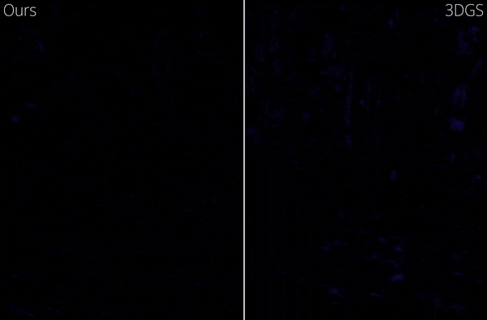
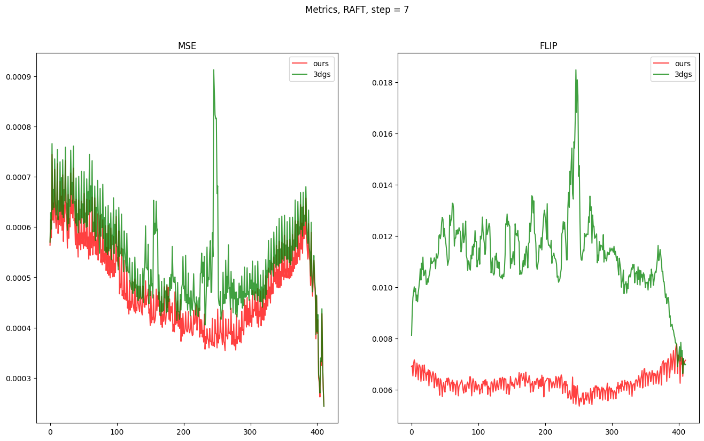

# PoppingDetection
[Lukas Radl](https://r4dl.github.io/)<sup>&#42;</sup>, 
[Michael Steiner](https://scholar.google.com/citations?hl=de&user=Pbtgcz8AAAAJ)<sup>&#42;</sup>,
[Mathias Parger](https://dabeschte.github.io/), 
[Alexander Weinrauch](https://scholar.google.com/citations?user=pkqf2mgAAAAJ&hl=de&oi=ao), 
[Bernhard Kerbl](https://snosixtyboo.github.io/), 
[Markus Steinberger](https://www.markussteinberger.net/)
<br> 
<sup>&#42;</sup> denotes equal contribution
<br>
| [Webpage](https://r4dl.github.io/StopThePop) 
| [Full Paper](https://arxiv.org/abs/2402.00525) 
| [Video](https://youtu.be/EmcXtHYhigk)
<!-- | [Pre-trained Models (14 GB)](https://repo-sam.inria.fr/fungraph/3d-gaussian-splatting/datasets/pretrained/models.zip)  -->
<br>
<!-- TODO: add a gif as teaser, this does not look nice  -->



This repository contains the official authors implementation for the popping detection method associated with the paper "StopThePop: Sorted Gaussian Splatting for View-Consistent Real-time Rendering", which can be found [here](https://r4dl.github.io/StopThePop). 

<section class="section" id="BibTeX">
  <div class="container is-max-desktop content">
    <h2 class="title">BibTeX</h2>
    <pre><code>@article{radl2024stopthepop,
  author    = {Radl, Lukas and Steiner, Michael and Parger, Mathias and Weinrauch, Alexander and Kerbl, Bernhard and Steinberger, Markus},
  title     = {{StopThePop: Sorted Gaussian Splatting for View-Consistent Real-time Rendering}},
  journal   = {ACM Transactions on Graphics},
  number    = {4},
  volume    = {43},
  articleno = {64},
  year      = {2024},
}</code></pre>
  </div>
</section>


## Overview
This repository takes a sequence of video frames or a video, and outputs detailed view-consistency metrics.
Specifically, we tackle popping artefacts, which are very specific to [3DGS](https://github.com/graphdeco-inria/gaussian-splatting/issues).
<br>
This repository is built on [RAFT](https://github.com/princeton-vl/RAFT) and [Fast Blind Video Consistency](https://github.com/phoenix104104/fast_blind_video_consistency), which are publily available.

## Licensing
This project is subject to the [MIT License](License.md), with the exception of:
* [core/](core/): BSD-3 License
* [popping_utils/occlusion_utils.py](popping_utils/occlusion_utils.py): MIT License
* [popping_utils/flip.py](popping_utils/flip.py): BSD-3 license

## Cloning the Repository

Clone the repository via
```shell
# HTTPS
git clone https://github.com/r4dl/PoppingDetection
```

## Setup

### Local Setup

Our default, provided install method is based on Conda package and environment management:
```shell
conda env create --file environment.yml
conda activate poppingdetection
```
As in [StopThePop](https://github.com/r4dl/StopThePop), this process assumes that you have CUDA SDK **11** installed, not **12**.

### Pretrained models
Pretrained models can be downloaded by running
```shell
bash download_models.sh
```
or downloaded from [Google Drive](https://drive.google.com/drive/folders/1sWDsfuZ3Up38EUQt7-JDTT1HcGHuJgvT?usp=sharing) directly.

### Running

Our popping detection method supports
<ul>
  <li>Videos</li>
  <li>A sequence of frames</li>
</ul> 

To run the popping detection, simply use

```shell
# Videos
python detect_popping.py -m <path to Model> -f <path to video1> <path to video2> --output_dir <output_path> --step <INT>
# Frame Sequences
python detect_popping.py -m <path to Model> -f <path to directory1> <path to directory2> --output_dir <output_path> --step <INT>
```

<details>
<summary><span style="font-weight: bold;">Command Line Arguments for detect_popping.py</span></summary>

  #### --model, -m
  Path to the model for optical flow prediction, we used ```models/raft-sintel.pth```
  #### --step
  Frame offset during optical flow prediction - we used 1,7 to evaluate short-range and long-range consistency, respectively
  #### --frame_directories, -f
  Directories (or videos) of videos to test
  #### --all_images
  Add this flag to output all MSE/FLIP predictions
  #### --warped
  Add this flag to output all warped images
  #### --output_dir
  Path to where the outputs should be stored (```output/<random>``` by default)
</details>

### Outputs
By default, ```detect_popping.py``` produces three outputs:
- Full Results
- Per View Results
- A Per-Frame Plot

#### Full/Per View Results
The full, averaged results are contained in ```<output_dir>/results.json``` and look like the following:
```json
{
  "MSE": {
    "ours": 0.0004816666263067259,
    "3dgs": 0.0005388583755252707
  },
  "FLIP": {
    "ours": 0.006288248952531622,
    "3dgs": 0.011204817680069102
  }
}
```
Similarly, the per-view results are contained in ```<output_dir>/per_view.json``` and look like:
```json
{
  "MSE": {
    "ours": {
      "00000.png": 0.0005637490773475146,
      "00001.png": 0.0006141854811676444,
      ...
    },
    "3dgs": {
      "00000.png": 0.0005698252213756839,
      "00001.png": 0.0006286655123918763,
      ...
    }
  },
  "FLIP": {
    "ours": {
      "00000.png": 0.006910023213958658,
      "00001.png": 0.0069372149966621605,
      ...
    },
    "3dgs": {
      "00000.png": 0.00812406283546771,
      "00001.png": 0.009072611476942128,
      ...
    }
  }
}
```

#### Per-Frame Plot

In addition to the previous results, we also include a per-frame plot, which looks like the following: 
<br>



### Notes
- Method names are automatically determined by either the video name or the frame directory name
- By default, when 2+ frame sequences/videos are considered, the minimum FLIP score per-pixel is subtracted for more stable metrics - this can be disabled by setting ```ENABLE_FLIP_MIN = False``` in ```detect_popping.py```
